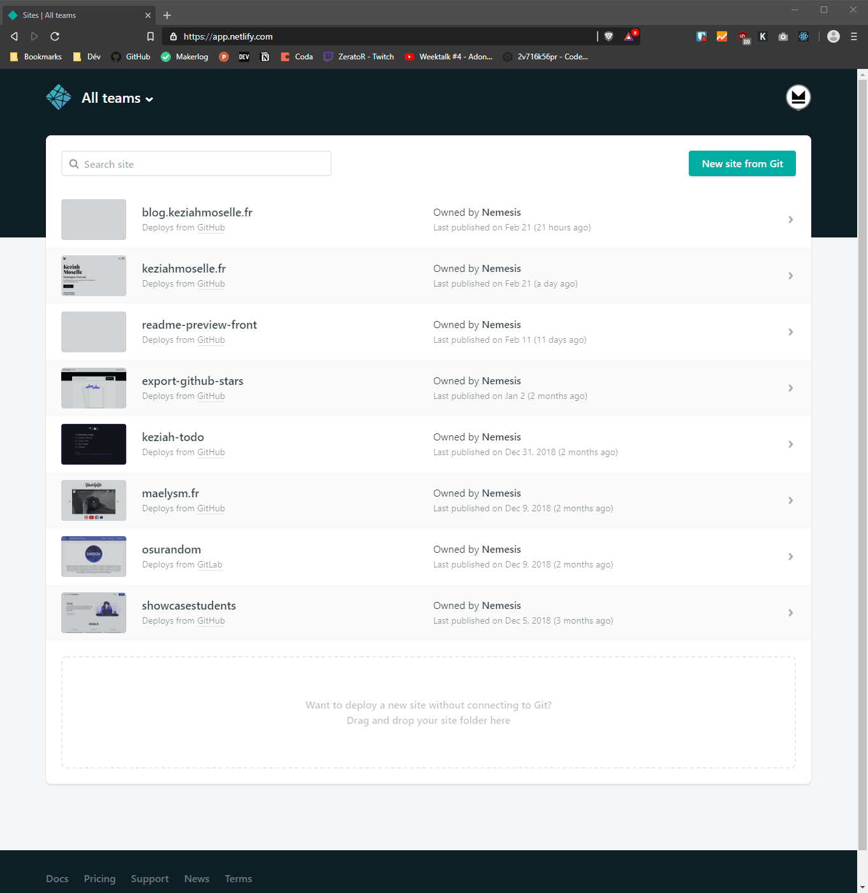
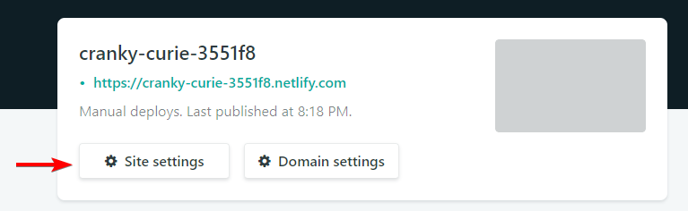
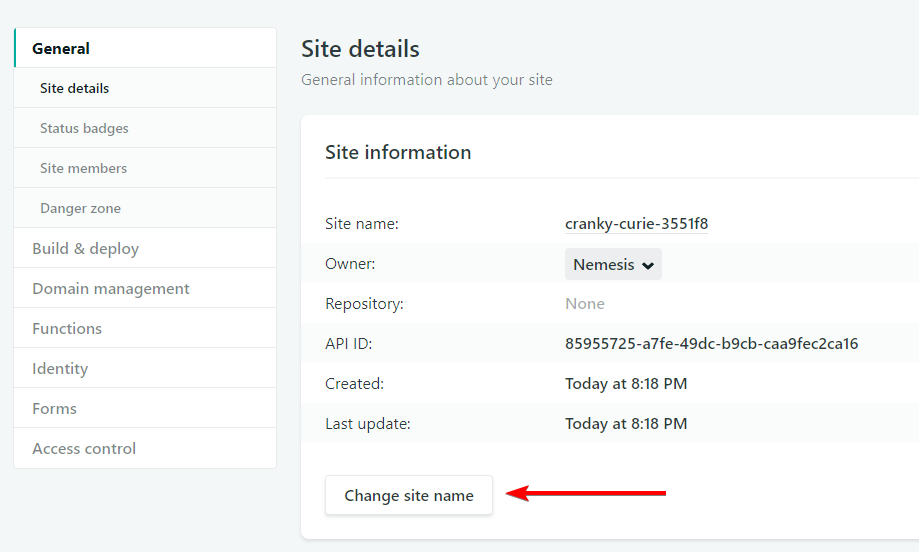
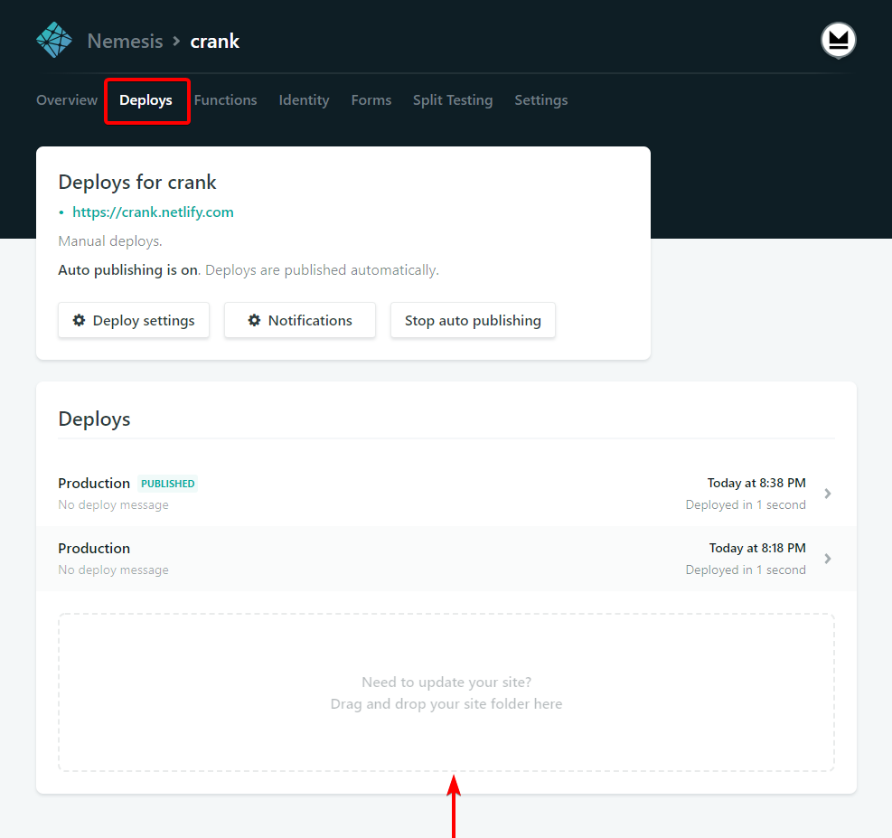
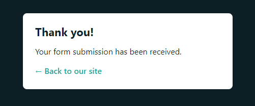
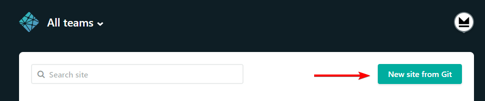
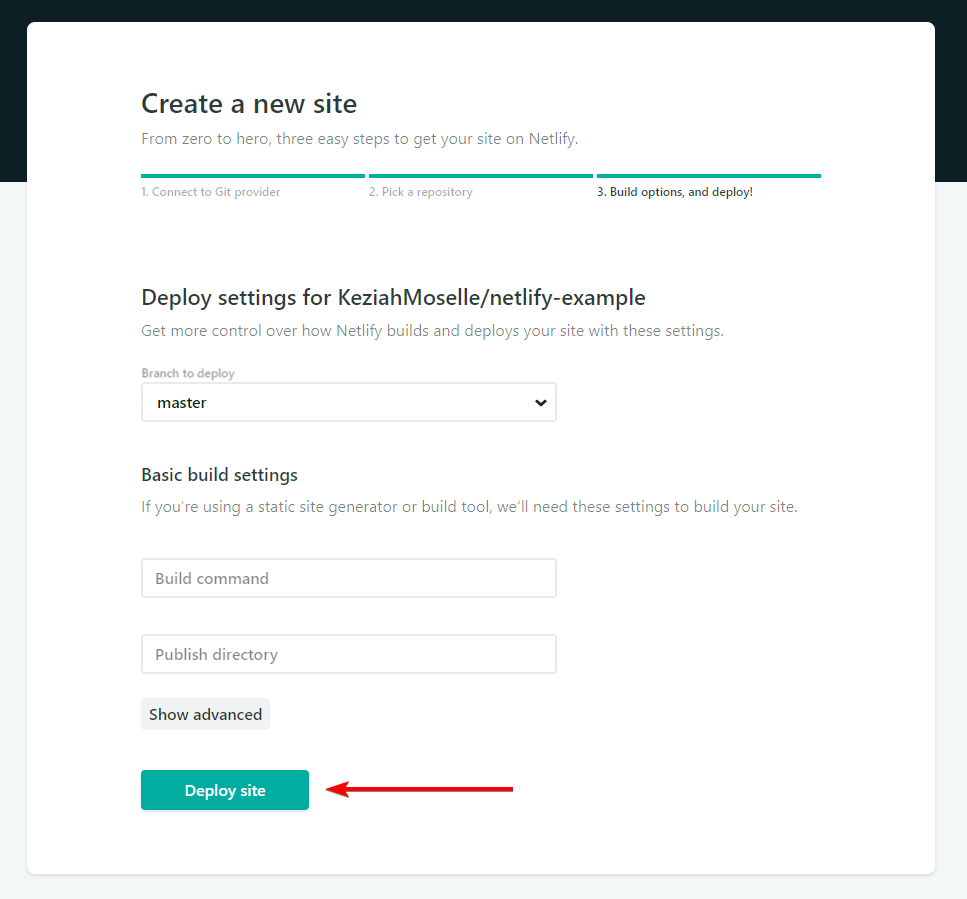

Netlify est un service qui vous permet d'héberger des sites statiques gratuitement en vous proposant d'autres fonctionnalités. ([Functions](https://www.netlify.com/features/functions/), [Identity](https://www.netlify.com/docs/identity/), [Forms](https://www.netlify.com/docs/form-handling/))


## Héberger un site statique

Très bien, vous avez réalisé un site et vous souhaitez l'héberger voici les étapes :

1. S'inscrire sur [https://app.netlify.com/signup](https://app.netlify.com/signup)
   
2. Pour héberger notre site nous avons deux possibilités : Nous pouvons le lier à Git ou déplacer un dossier Nous allons d'abord déplacer notre dossier pour voir ce qu'il se passe.


   
3. Nous sommes sur l'interface de gestion de notre site, c'est ici où nous pouvons modifier les paramètres de celui-ci.
Votre site a été publié à une addresse avec un nom généré aléatoirement. Vous pouvez cliquer sur l'URL pour y accéder !

4. Et voilà vous avez publié votre site ! Mais.. nous n'allons pas rester avec un nom tel que "cranky-curie-3551f8" ! Modifions le :
   

   
5. 
Et voilà, une fois le nom modifié vous avez accès à votre site sous la forme "[name].netlify.com"

> Remarque : Le protocole HTTPS est configuré et renouvelé automatiquement pour vous

## Recevoir les données de votre formulaire
Maintenant que nous avons notre site  statique en ligne nous voulons recevoir le contenu de nos formulaires !

1. Nous devons modifier notre code HTML comme ceci :
```html
<form name="contact" method="POST" netlify>
  ...
</form>
```

Nous n 'avons plus besoin d'`action`, Netlify s'en occupe pour nous grâce à l'attribut `netlify` ou `data-netlify="true"` et `name` correspondra au nom du formulaire sur l'interface de Netlify.

2. Maintenant, nous devons mettre à jour notre site en déplacant notre dossier dans le cadre :
   


3. Tester le formulaire
   


1. Et voilà ! Si vous souhaitez avoir plus d'informations : [https://www.netlify.com/docs/form-handling/](https://www.netlify.com/docs/form-handling/)


## Utiliser Netlify en liant un compte GitHub

### Prérequis
* Avoir un compte GitHub, GitLab ou Bitbucket
* Comprendre les bases de Git
* Avoir un dépôt distant déjà existant
  
Nous avons vu comment mettre en ligne votre site et comment le mettre à jour, mais cette méthode n'est pas très pratique !
Et bien il en existe une autre qui se lie à votre dépôt Git en ligne (Netlify supporte : [GitHub](https://github.com/), [GitLab](https://gitlab.com/) et [Bitbucket](https://bitbucket.org/)), cette méthode vous permet donc de mettre à jour votre site automatiquement à chaque `git push origin` et également sur vos autres branches !

1. Créer un nouveau site à partir de Git :




1. Connectez-vous sur [GitHub](https://github.com/), [GitLab](https://gitlab.com/) ou [Bitbucket](https://bitbucket.org/)

2. Choisissez votre dépôt

3. La partie **Basic build settings** est **optionnel** pour un site HTML/CSS classique



1. Votre site est publié ! Maintenant à chaque `push` Netlify va mettre à jour votre site !