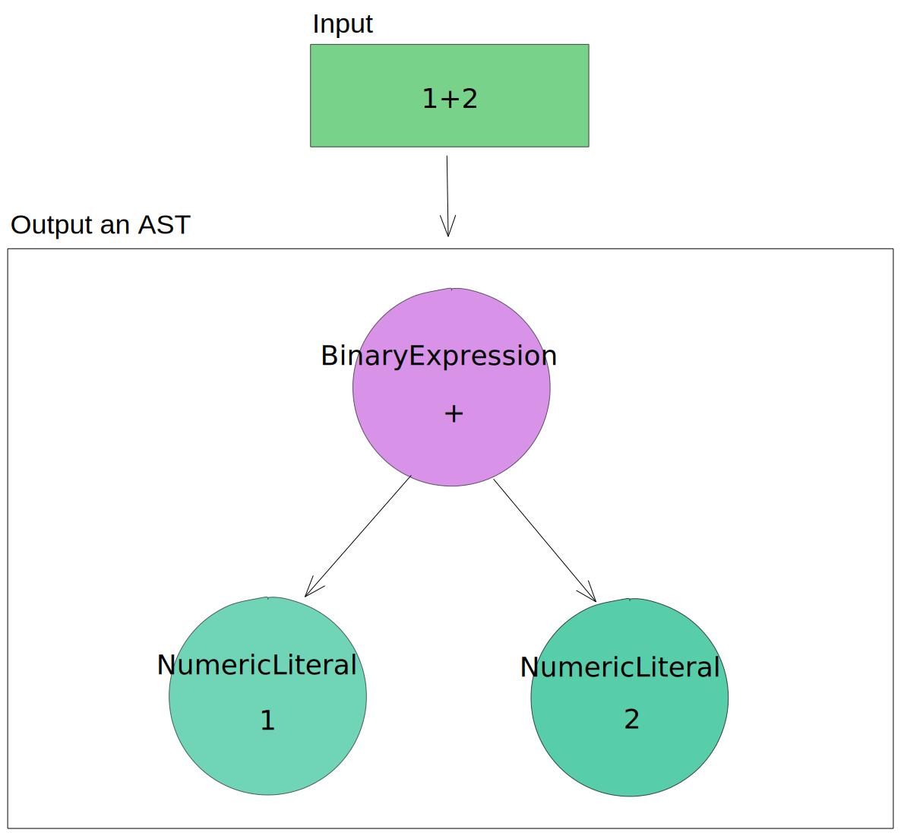
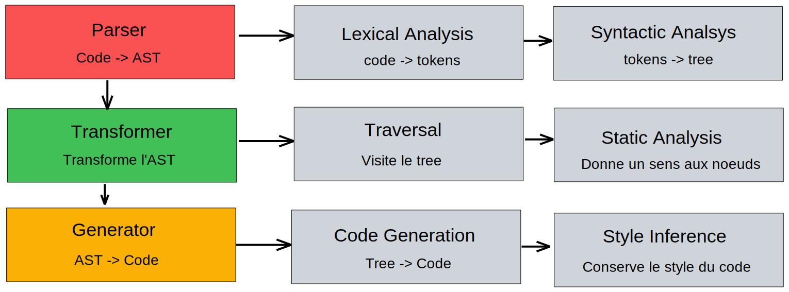

# Qu'est-ce que Babel ?

Babel (prononcé ["babble"](https://soundcloud.com/sebmck/how-to-pronounce-babel)) est un transpiler qui vous permet de profiter de nouvelles syntaxes et fonctionnalités de JavaScript en avance tout en supportant d'anciennes versions de navigateurs.

Anciennement nommé "6to5" comprendre par là que l'outil permettait de prendre du code JavaScript dit "ES6" (sorti en 2015) et de générer l'équivalent en ES5 (2009) permettant donc de supporter une large variété de navigateurs.

[Sebastian McKenzie](https://twitter.com/sebmck) le créateur initial de 6to5 l'a donc renommé "Babel" dans le but d'éviter de changer le nom tous les ans :)

> Les versions d'ECMAScript sont désormais nommées par leur année de sortie dans le but d'encourager le support de nouvelles fonctionnalités au plus vite. (ES2015, ES2016...)

En résumé cela vous permet :

- D'utiliser de nouvelles fonctionnalités
- De supporter d'anciens navigateurs
- Transformer certaines parties de votre code
- et + encore (TypeScript, JSX...)


# Comment installer Babel ?

Il vous faudra le gestionnaire de paquets [NPM](https://www.npmjs.com/). Installé par défaut via l'installation de [Node.js](https://nodejs.org/) ou via [NVM](https://github.com/nvm-sh/nvm)

Pour commencer il vous faudra être à la racine de votre projet et créer un fichier `package.json` via cette commande :

```bash
# Répondez aux questions :
npm init

# Passez les questions
npm init --yes
```

Puis répondez aux questions.

Maintenant nous allons installer 2 dépendances :

- @babel/cli pour nous permettre de transpiler via un CLI
- @babel/core pour build notre code source en code de distribution

```
npm install @babel/core @babel/cli --save-dev
```

Vous devriez maintenant avoir 2 nouvelle clés dans votre `package.json` comme suit :

```json
"devDependencies": {
  "@babel/cli": "^7.8.4",
  "@babel/core": "^7.8.7",
}
```

Nous allons maintenant rajouter un script à notre `package.json` pour faciliter l'exécution de la commande dans le futur :

```json
"scripts": {
  "build": "babel src -d build",
  "watch": "babel src -d build --watch --source-maps"
}
```

la commande de `build` se construit ainsi : `babel <source-folder> -d <destination-folder>`, changez les noms de dossiers en fonction de votre structure !
Babel prendra donc votre dossier source et transpilera tous les fichiers .js dans le dossier de destination, il faudra donc importer les fichiers de destination dans votre build final !

Nous pouvons également rajouter un script `watch` qui va s'occuper d'observer les changements à nos fichier sources puis les transpilera automatiquement à chaque changement, en plus de cela nous pouvons rajouter le support des source maps qui nous aidera à mapper la ligne original dans le fichier source.

Une fois l'installation faite, nous devons configurer Babel sans quoi il ne fera aucune modification vu que nous lui avions rien demandé de faire pour le moment.

# Comment le configurer ?

Pour configurer Babel nous avons [plusieurs options](https://babeljs.io/docs/en/configuration) à notre disposition mais nous allons utiliser la plus simple :

1. Créer un fichier `.babelrc.json`
   
   RC peut signifier plusieurs choses : run commands, run control, runtime configuration ou resource control

2. Nous allons lister différents presets et plugins dans ce fichier .json comme suit :

```json
{
  "presets": [],
  "plugins": []
}
```

- Un plugin permet à Babel de comprendre une nouvelle syntaxe (et le transformer transpilera cette syntaxe ! un plugin n'apporte pas toujours un transformer !)
  - Supporter des fonctionnalités expérimentales ([babel-plugin-proposal-partial-application](https://babeljs.io/docs/en/babel-plugin-proposal-partial-application))
  - Faire de la minification spécifique [babel-plugin-transform-minify-booleans](https://babeljs.io/docs/en/babel-plugin-transform-minify-booleans)
  - et d'autres choses mais toujours spécifique !

- Un preset est un **ensemble de plugins** pour supporter un ensemble
  
  Exemple de presets : es2015, es2016, es2017, latest, env, react...
  - Il vous évite d'écrire une longue liste de plugins
  - Vous permet de composer votre propre environnement


Nous allons utiliser un preset nommé : `babel-preset-env`, pour l'installer :

```
npm install @babel/preset-env --save-dev
```

Nous devons ajouter notre preset à notre fichier de configuration `.babelrc.json` :

```json
{
  "presets": ["@babel/preset-env"]
}
```

> Vous pouvez configurer ce preset directement depuis le fichier .babelrc.json, [voir la documentation](https://babeljs.io/docs/en/babel-preset-env) pour en savoir plus

ce preset est spécial car il nous permet de profiter d'une détection automatique de ce que nous voulons transpiler ou non, pour cela il utilise une table de compatibilité venant de plusieurs sources : [browserslist](https://github.com/browserslist/browserslist), [compat-table](https://github.com/kangax/compat-table) et [electron-to-chromium](https://github.com/Kilian/electron-to-chromium).

Pour profiter de cette auto-détection nous devons spécifier une liste de navigateurs à supporter.

Si nous ne spécifions pas de navigateurs/versions par défaut le preset transpilera tout le code ES2015+ (ce qui peut causer un bundle plus lourd !)

Pour spécifier un environnement à supporter nous pouvons ajouter une clé à notre `package.json` comme ceci :

```json
{
  ...
  "browserslist": [
    "> 0.5%",
    "last 2 versions",
    "not dead"
  ]
  ...
}
```

Ici nous spécifions à [browserslist](https://github.com/browserslist/browserslist) de supporter tous les navigateurs avec plus de 0.5% d'utilisation (monde), les 2 dernières versions de navigateurs récents et tous les navigateurs qui sont toujours utilisés. Ce qui couvre une grande partie des cas. (ce qui correspond aux options de "defaults")

> Vous pouvez voir une liste exhaustive d'options sur le repository de [browserslist](https://github.com/browserslist/browserslist)
> 
> Et si vous souhaitez avoir un aperçu du résultat de votre query vous pouvez la tester sur ce site : [browserl.ist](https://browserl.ist/)

Et voilà ! Vous pouvez maintenant écrire du code JavaScript moderne tout en supportant d'anciens navigateurs.

Babel est un outil qui vous permet de personnaliser plugins et presets, n'hésitez pas à en ajouter/configurer pour couvrir votre besoin.


# Babel en détails
Nous allons voir maintenant le fonctionnement en détails de Babel :

Babel est divisé en 3 parties distinctes :

- Le **Parser**
- Le **Transformer**
- et le **Generator**

à la fin de ces trois étapes, Babel va nous générer le code final.

## Parser

Le parser va lire votre code source et donner en sortie un **Abstract Syntax Tree** (AST).

un AST est une représentation de votre code sous forme d'arbre représentant pour chaque noeud une partie de votre programme et est utilisé par un autre programme dans le but de réaliser une autre tâche.



> Vous pouvez voir à quoi ressemble un AST en détails sur ce site en y collant votre code : [astexplorer.net](https://astexplorer.net/)


## Transformations

Après avoir généré un premier AST, Babel va faire passer un **visitor** qui viendra traverser l'AST en lui appliquant des modifications, ce processus est nommé **Traversal**.

On traverse donc l'arbre tout en conservant le **sens** de notre code.

Voyons maintenant pourquoi il est nécessaire de conserver ce **sens**.
Imaginons que nous ayons une fonction qui nous renverrai un tableau comme suit :

```js
[x, y] = calculateCoordinates()
```

Nous déstructurons le premier et le deuxième index du résultat de la fonction `calculateCoordinates`

Une sortie simple serait :
```js
var _ref = calculateCoordinates()
x = _ref[0]
y = _ref[1]
```

Ce qui devrait fonctionner, maintenant imaginons que nous faisions la même chose mais au sein d'une fonction comme ceci :

```js
doSomething([x, y] = calculateCoordinates())
```

Sans considérer le sens de notre code, Babel nous aurait rendu :

```js
doSomething(
  var _ref = calculateCoordinates()
  x = _ref[0]
  y = _ref[1]
)
```

Ce qui est invalide car la fonction attend une expression en tant qu'argument, dans ce cas-ci JavaScript lancera une exception de type `SyntaxError` car nous faisons une déclaration de variable et des assignements.

Grâce à un processus que l'on nomme **Static Analysis**, Babel va pouvoir comprendre notre code et plutôt nous retourner ceci :

```js
var _ref

doSomething((
  _ref = calculateCoordinates(),
  x = _ref[0],
  y = _ref[1],
  _ref
))
```

> Les résultats ci-dessus ne sont pas de réels sorties de Babel, mais permettent d'illustrer le problème.


La transformation peut être résumé de cette manière :
- Entrée : AST
- Sortie : AST' (modifié)

Un example de modification que l'on peut réaliser durant cette étape :

```js
// Turn this
import module from 'module'

// Into this
var module = require('module')
```

Mais toujours sous forme d'AST et non de code source !


## Generator

À partir de l'AST, Babel va donc maintenant générer le code source final.
Une chose à noter est qu'il va conserver le style de votre code (indentation, single ou double quotes...) ce processus est nommé : **Style Inference**

## Schéma



# Aller plus loin

## Webpack

Lorsque votre application nécessite un grand nombre de fichiers .js il est fortement recommandé d'utiliser un bundler tel que Webpack, Parcel, Rollup...

Il est possible d'utiliser Babel au sein de ces bundlers. Ici pour Webpack il s'agit d'un simple loader à ajouter dans vos règles :

Dans le cas de Webpack il s'agit du module : [babel-loader](https://webpack.js.org/loaders/babel-loader/)

```js
module: {
  rules: [
    {
      test: /\.m?js$/, // Transpile les fichiers .js et .mjs (module js)
      exclude: /node_modules/,
      use: {
        loader: 'babel-loader',
        options: {
          presets: ['@babel/preset-env']
        }
      }
    }
  ]
}
```

## Ressources

- La documentation de [Babel](https://babeljs.io/docs/en/)

- Les proposals au sein du TC39 : [https://github.com/tc39/proposals](https://github.com/tc39/proposals)

- [Sebastian McKenzie](https://twitter.com/sebmck) le créateur initial de Babel a annoncé la sortie publique de [Rome](https://romejs.dev/) un outil all-in-one dans le but de remplacer la multitude d'outils existants en JavaScript.

https://twitter.com/sebmck/status/1232885861135421441

Merci d'avoir lu cet article ! J'espère que vous l'avez apprécié, si vous avez des retours n'hésitez pas !

Si vous repérez une erreur, cliquez sur "Edit on GitHub" en fin de page !