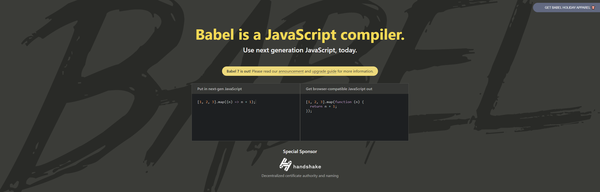
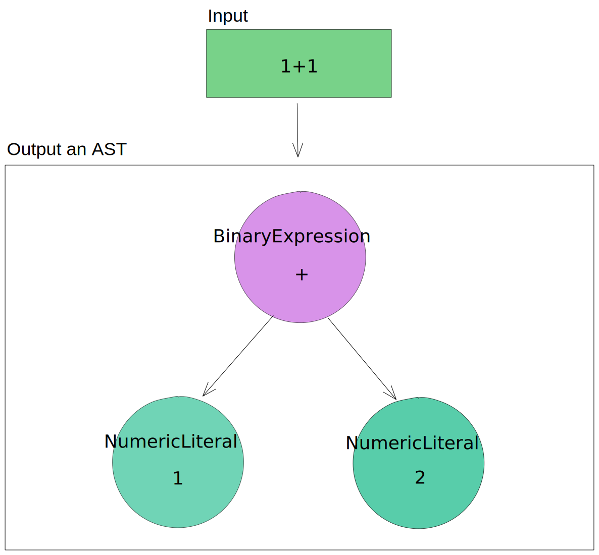
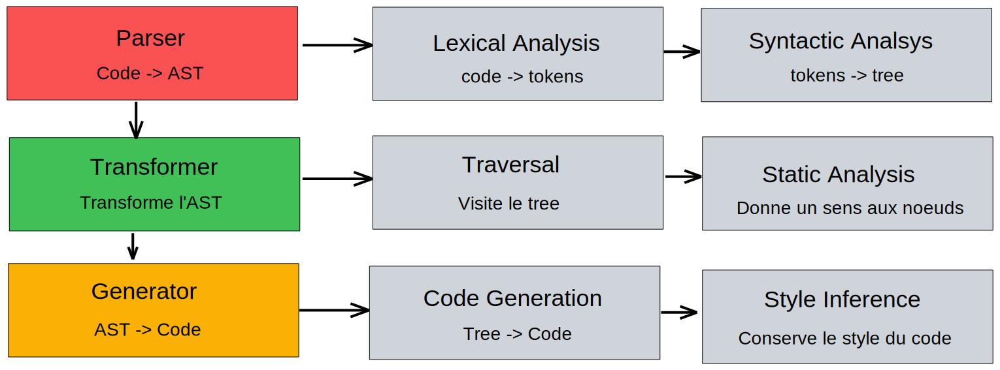

# Qu'est-ce que Babel ?

Babel (prononcé ["babble"](https://soundcloud.com/sebmck/how-to-pronounce-babel)) est un transpiler qui vous permet de profiter de nouvelles syntaxes et fonctionnalités de JavaScript en avance tout en supportant d'anciennes versions de navigateurs.

Anciennement nommé "6to5" comprendre par là que l'outil permettait de prendre du code JavaScript dit "ES6" (sorti en 2015) et de générer l'équivalent en ES5 (2009) permettant donc de supporter une large variété de navigateurs.

[Sebastian McKenzie](https://twitter.com/sebmck) le fondateur initial de 6to5 l'a donc renommé "Babel" dans le but d'éviter de changer le nom tous les ans :)

> Les versions d'ECMAScript sont désormais nommées par année dans le but d'encourager le support de nouvelles fonctionnalités au plus vite. (ES2015, ES2016...)

En résumé cela vous permet :

- D'utiliser de nouvelles fonctionnalités
- De supporter d'anciens navigateurs
- Transformer certaines parties de votre code
- et + encore (TypeScript, JSX...)


## Babel en détails

Nous allons d'abord commencer par voir le fonctionnement en détails de Babel, mais si vous ne souhaitez pas rentrer dans les détails et uniquement apprendre comment l'utiliser et le configurer vous pouvez [passer cette section](#comment-linstaller-).

Babel est divisé en 3 parties distinctes :

- Le **Parser**
- Le **Transformer**
- et le **Generator**

à la fin de ces trois étapes, Babel va générer le code final.

### Parser

Le parser va lire votre et donner en sortie un *Abstract Syntax Tree* (AST).

un AST est une représentation de votre code et est utilisé par un autre programme dans le but de réaliser une autre tâche.



Vous pouvez voir à quoi ressemble un AST en détails sur ce site en y collant votre code : [astexplorer.net](https://astexplorer.net/)


### Transformations

Après avoir généré un premier AST, Babel va faire passer un **visitor** qui viendra traverser l'AST en lui appliquant des modifications, ce processus est nommé *Traversal*.

La transformation peut être résumé de cette manière :
- Entrée : AST
- Sortie : AST' (modifié)

Un example de modification que l'on peut réaliser durant cette étape :

```js
// Turn this
import Module from 'module'

// Into this
var module = require('module')
```

Mais toujours sous forme d'AST et non de code source !


### Generator

À partir de l'AST, Babel va donc maintenant générer le code source final.
Une chose à noter est qu'il va conserver le style de votre code (indentation, single ou double quotes...) ce processus est nommé : *Style Inference*

### Schéma



# Comment installer Babel ?

...

# Comment le configurer ?

`.babelrc.js`

`babel-preset-env` -> browsers target or node target

...

# Aller plus loin

...


[https://romejs.dev/](https://romejs.dev/)