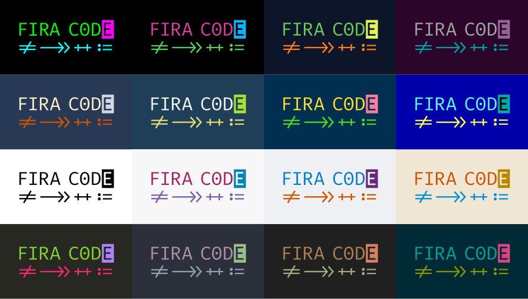

> This page was inspired by the works of [Wes Bos](https://wesbos.com/uses/) and [Ali Spittel](https://zen-of-programming.com/uses/).
> 
> See [awesome-uses](https://github.com/wesbos/awesome-uses)

## Editor

I started coding in 2014 with [Brackets](http://brackets.io/) mainly because it had the most powerful live preview back then, it was perfect for a beginner like me.
I switched to [Atom](https://atom.io/) when it came out, it was great but it was slow so I switched to VS Code in 2018.

### Theme

I use [Horizon](https://marketplace.visualstudio.com/items?itemName=jolaleye.horizon-theme-vscode) :

I also made a [Prism.js theme for Horizon](https://github.com/KeziahMoselle/horizon-prismjs-theme)

### Font

I use [Fira Code](https://github.com/tonsky/FiraCode) :

### Extensions

These are the main extensions I use : ([All my extensions](https://gist.github.com/KeziahMoselle/68b4ed2ccbfea5bd15fd8506386841dc))

- [ESLint](https://marketplace.visualstudio.com/items?itemName=dbaeumer.vscode-eslint) - Lint my code
- [Prettier](https://marketplace.visualstudio.com/items?itemName=esbenp.prettier-vscode) - Format my code
- [Material Icon Theme](https://marketplace.visualstudio.com/items?itemName=PKief.material-icon-theme) - Icon pack
- [Bracket Pair Colorizer](https://marketplace.visualstudio.com/items?itemName=CoenraadS.bracket-pair-colorizer) - Colorize brackets
- [Markdown All in One](https://marketplace.visualstudio.com/items?itemName=yzhang.markdown-all-in-one) - Preview Markdown files in a tab and more
- [WakaTime](https://marketplace.visualstudio.com/items?itemName=WakaTime.vscode-wakatime) - Metrics and insights about my programming activity
- [colorize](https://marketplace.visualstudio.com/items?itemName=kamikillerto.vscode-colorize) - Colorize colors
- [Syncing](https://marketplace.visualstudio.com/items?itemName=nonoroazoro.syncing) - Sync all my extensions and settings in a [GitHub Gist](https://gist.github.com/KeziahMoselle/68b4ed2ccbfea5bd15fd8506386841dc)

## Terminal

I use [Hyper](https://hyper.is/) (Bash + zsh)

## Desktop apps

- [Brave](https://brave.com/) - My browser
- [Notion](https://notion.so) - My todo/notes app
- [Figma](https://www.figma.com/) - I use Figma for my designs
- [Zeplin](https://zeplin.io) - I use Zeplin to open Sketch/XD/PSD files
- [GitHub Desktop](https://desktop.github.com/) - Git GUI for all my Git repositories (GitHub and GitLab)
- [Sublime Merge](https://www.sublimemerge.com/) - I also use Sublime Merge as an alternative for it's features
- [Insomnia](https://insomnia.rest/) - My REST client

## Tools & Misc

These are the tools I use frequently.

- [Netlify](https://www.netlify.com/) - Host this blog, my website and hobbies projects
- [Cloudflare](https://www.cloudflare.com/) - For my DNS needs
- [CodeSandbox](https://codesandbox.io/) - Online code editor when I need to prototype something quick
- [Meta Tags](https://metatags.io/) - Preview and debug meta tags
- [svgo](https://github.com/svg/svgo) - Optimize .svg files
- [30 SECONDS OF KNOWLEDGE](https://30secondsofknowledge.com/) - Tab extension, learn something when I open a new tab
- [Streaker](https://github.com/jamieweavis/streaker) - Track my GitHub activity right in the tray (I worked on it btw !)
- [Bitwarden](https://bitwarden.com/) - My password manager
- [DevHub](https://devhubapp.com/) - Manage my GitHub notifications and track repositories
- [FastHub](https://github.com/k0shk0sh/FastHub) - My mobile GitHub client
- [LabCoat](https://gitlab.com/Commit451/LabCoat) - My mobile GitLab client

## Gear

- Computer
  - CPU : i7 8700K @4.7GHz
  - Watercooler : NZXT KRAKEN X72
  - Graphic Card : ASUS ROG STRIX GeForce RTX 2080 OC
  - RAM : Corsair Vengeance RGB Pro 32Go 3200 MHz CAS 14
  - Motherboard : ASUS ROG STRIX Z370-E
  - SSD : Samsung Serie 970 EVO NVMe M.2 - 500 Go
  - HDD : Seagate BarraCuda 2 To
  - Power Supply : Seasonic PRIME Ultra 750 Titanium
  - Case : NZXT H700i - White
- Peripherals
  - Main monitor : Asus ROG Swift PG279Q 27" 2560*1440 144Hz
  - Monitors : Iiyama G-MASTER GB2530HSU-B1 24" 1920*1080
  - Keyboard : Cooler Master MasterKeys MK750 - Cherry MX Red
  - Mouse : ROCCAT Kova - Black
  - Headset : SteelSeries Arctis 7 - White
- My phone : OnePlus 6
- Seat : DXRacer Formula F08 - White
- NAS : Synology NAS DS218 (RAID1)
- My backpack : XD Design Bobby XL 17", black

## My desk

