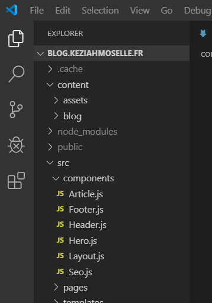
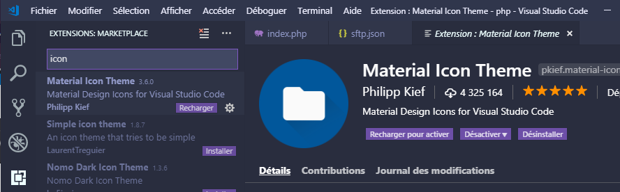

# Installation de Visual Studio Code Portable

> **Remarque** : Si vous n'êtes pas contraint d'utiliser la version portable préférez la version User ou System installer.

Il est possible d'installer la version portable officiel depuis : [https://code.visualstudio.com/download](https://code.visualstudio.com/Download)

- Télécharger Visual Studio Code en .zip (version 64 bits)


- Extraire le .zip dans un dossier (avec l'aide de 7zip ou Winrar...)


- dans le cadre de l'IUT il faut l'extraire dans votre disque S:\\ pour qu'il soit accessible depuis n'importe quel poste.
    - Vous pouvez également mettre votre dossier sur une clé USB pour le lancer depuis celle-ci

Maintenant, vous avez un dossier du style : 


- Créer un dossier "data"


- Voilà ! Maintenant il suffit de lancer :


Pour plus d'informations sur la version portable : 

[Portable Mode in Visual Studio Code](https://code.visualstudio.com/docs/editor/portable)

---

# Comment utiliser Visual Studio Code ?

## Présentation

Après l'installation si nous ouvrons VSCode nous arrivons sur :


- Tout d'abord nous allons ouvrir un projet :


- Différents onglets sont disposés à gauche :
    - Explorer : C'est votre dossier

    

    - Search : C'est comme un CTRL+F (Rechercher dans une page ...) ou CTRL + H sur Powerpoint !

    

    - Extensions :

    

Je ne parlerais pas des deux autres onglets car ils ne sont pas pertinent pour le moment

---

## Comment changer de langue ?

Vous n'êtes pas à l'aise avec tous les termes du développement et vous voulez changer de langue ? Pas de soucis, rendez-vous sur l'onglet **Extensions** et rechercher : 


L'éditeur détecte que vous voulez changer de langue et vous demande si vous voulez changer de langue immédiatement


et voilà, votre éditeur est en français

---

## Installation d'un thème de couleur et d'icônes

Bon, c'est bien on a installé notre éditeur, mais il est possible que vous souhaitez changer l'apparence de votre éditeur pour être plus à l'aise avec

- Rendez vous sur l'onglet **Extensions**
- Rechercher : @category:themes
- Maintenant, une liste de thèmes est apparu, cliquer sur chacun d'eux, vous avez un aperçu du thème à droite comme par exemple :


- Cliquer sur Installer
- VSCode va maintenant appliquer votre thème automatiquement

- Si vous souhaitez changer de thème plus tard vous pouvez accéder au menu ici :
  


> **Remarque** : Il existe des thèmes préinstallé, si l'un d'eux vous correspond il n'est pas nécessaire d'installer des thèmes supplémentaire


- Installer un pack d'icônes :



- Installer le comme un thème

- Avant / Après


---

## Observer les changements en temps réel avec un site statique (Live Server)

- Aller sur l'onglet Extensions et télécharger Live Server


- OUVRIR UN DOSSIER est primordial pour pouvoir lancer Live Server, car il va prendre le chemin vers ce dossier pour l'ouvrir dans votre navigateur !
- Cliquer sur "Go Live"


- S'il n'apparaît pas, vous pouvez ouvrir la palette de commandes : CTRL+Shift+P ou F1


> **Remarque** : Si vous souhaitez utiliser Live Server avec de la génération côté serveur : [https://github.com/ritwickdey/live-server-web-extension](https://github.com/ritwickdey/live-server-web-extension)

---

## Enregistrement automatique des fichiers après modification

- Les paramètres se situe ici :


- Passer le Files: Auto Save à afterDelay

- Fichier > Enregistrement Automatique


- Maintenant l'éditeur va automatiquement sauvegarder après 1 seconde (1000ms par défaut)
- Cela peut paraître un peu lent lorsque vous utilisez Live Server en parallèle :

    Vous pouvez alors modifier la valeur en millisecondes :


> **Remarque**:  Plus vous baissez les ms, plus votre éditeur risque d'être lent (Surtout en version portable !)
> Vous pouvez également choisir onFocusChange ou onWindowChange si un délai ne vous correspond pas.

---

## Agrandir la police d'écriture

La taille de police par défaut est à 14px, ce qui peut être désagréable à lire.

Il suffit de changer la taille (en pixels donc)


> **Remarque** : Il est possible d'agrandir la police d'écriture directement depuis l'éditeur, ouvrer un fichier de votre choix, puis appuyer sur CTRL et + (du pavé numérique) ou CTRL et - (du pavé numérique)

---

## Comment utiliser une extension de FTP/SFTP ?

**DESACTIVER L'ENREGISTREMENT AUTOMATIQUE PENDANT LA CONFIGURATION QUI SUIT :**

- Installer une extension FTP/SFTP : (En loccurence ici SFTP, mais le principe est le même)


- Ouvrer la palette de commandes (F1 ou CTRL+Shift+P)


- Il va créer un dossier caché : .vscode et créer un fichier sftp.json

```json
{
    "protocol": "sftp",
    "host": "localhost",
    "port": 22,
    "username": "username",
    "remotePath": "/"
}
```

- Il nous demande plusieurs champs à remplir :
    - protocol : c'est le protocole donc SFTP, FTP... (Utiliser SFTP de préférence car sécurisé)
    - host : c'est l'adresse IP ou le nom de domaine
    - port : SFTP utilise le port : 22 (SSH) et FTP : 21
    - username : ça sera votre nom d'utilisateur de l'IUT
    - remotePath : ça sera l'endroit par défaut où vous allez être après la connexion
- Dans le cadre de l'IUT (Et notamment se connecter au serveur TP) il faudra remplir de cette manière :

```json
{
    "protocol": "sftp",
    "host": "tp.iha.unistra.fr",
    "port": 22,
    "username": "TonNomDeFamille",
    "remotePath": "/iut/users/nomDeFamille/public_html/"
}
```

- Petit problème, il va nous demander notre mot de passe à chaque fois ! Nous devons donc rajouter notre mot de passe :

```json
    {
        "protocol": "sftp",
        "host": "tp.iha.unistra.fr",
        "port": 22,
        "username": "TonNomDeFamille",
        "password": "votreSuperMotDePasse",
        "remotePath": "/iut/users/nomDeFamille/public_html/"
    }
```

- Mais, nous ne voulons pas mettre notre mot de passe sur le serveur TP ! Nous allons demander à l'extension d'ignorer certains fichiers ou dossiers :

```json
    {
        "protocol": "sftp",
        "host": "tp.iha.unistra.fr",
        "port": 22,
        "username": "TonNomDeFamille",
        "password": "votreSuperMotDePasse",
        "remotePath": "/iut/users/nomDeFamille/public_html/",
        "ignore": [
            ".vscode"
        ]
    }
```

- Version MacOS :

```json
    {
        "protocol": "sftp",
        "host": "tp.iha.unistra.fr",
        "port": 22,
        "username": "TonNomDeFamille",
        "password": "votreSuperMotDePasse",
        "remotePath": "/iut/users/nomDeFamille/public_html/",
        "ignore": [
            ".vscode",
    		".DS_Store"
        ]
    }
```

> **Remarque** : Rajoutez .DS_Store seulement si vous êtes sous MacOS, c'est un fichier uniquement présent sur ce système d'exploitation (est un fichier caché), il ne sert à rien de le mettre sur le serveur, nous pouvons donc l'ignorer.

- Maintenant il faut dire à l'extension : Dès que je sauvegarde, remplace le fichier sur le serveur !

```json
    {
        "protocol": "sftp",
        "host": "tp.iha.unistra.fr",
        "port": 22,
        "username": "TonNomDeFamille",
        "password": "votreSuperMotDePasse",
        "remotePath": "/iut/users/nomDeFamille/public_html/",
        "ignore": [
            ".vscode",
    		".DS_Store"
        ],
    	"uploadOnSave": true
    }
```

- Si maintenant vous effectuez des modifications sur un fichier et que vous l'enregistrez, si l'extension fonctionne il devrait vous afficher "done nomDuFichier.ext"


**VOUS POUVEZ REACTIVER L'ENREGISTREMENT AUTOMATIQUE**

RAPPEL : l'adresse pour accéder à votre serveur est : [https://tp.iha.unistra.fr/~NOMDEFAMILLE/](https://tp.iha.unistra.fr/~nomdefamille/)